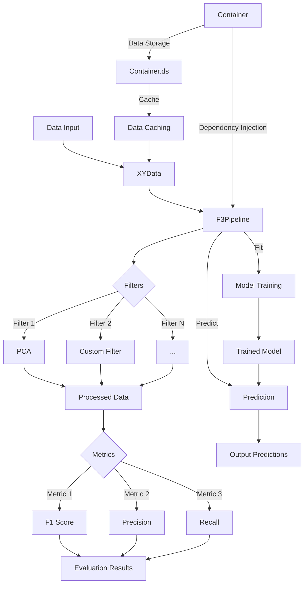

# 🏗️ Framework3 Architecture

Framework3 is designed with a modular, decoupled, and extensible architecture, built to support experimentation, evaluation, and comparison of models or processes in AI environments in a fully reproducible way.

### 🔌 Core Components

| Component       | Description                                               |
|----------------|-----------------------------------------------------------|
| `BaseFilter`   | Functional component that transforms, trains, or predicts |
| `BasePipeline` | Chains multiple filters into a sequential or parallel strategy |
| `BaseMetric`   | Evaluates the performance of models or pipelines          |
| `BaseSplitter` | Splits data into folds for validation                     |
| `BaseOptimizer`| Optimizes hyperparameters over pipelines or filters       |
| `BaseStorer`   | Manages storage and retrieval of objects                  |

### 🔄 Typical Flow

<div style="zoom: 1.3; display: inline-block;">


</div>

### 🧬 Design Principles

- **Modularity**: each class has a single responsibility and does it well.
- **Dependency Injection**: plugins are registered and configured via a `Container`.
- **Extensibility**: easily create new components without modifying the core.
- **Reproducibility**: all pipelines are configurable and fully traceable.

---

# 🧩 How to Extend Framework3

Framework3 is designed to be *hacked*. Here's how to build and plug in your own components.

## ➕ Creating a Custom Filter

```python
from framework3.base import BaseFilter

class MyAwesomeFilter(BaseFilter):
    def fit(self, x, y=None):
        # your training logic
        return 0.92

    def predict(self, x):
        # your inference logic
        return x
```

Register it for named usage:

```python
from framework3.container import Container
Container.bind("MyAwesomeFilter", MyAwesomeFilter)
```

Or register it via decorator:

```python
from framework3.base import BaseFilter
from framework3.container import Container

@Container.bind()
class MyAwesomeFilter(BaseFilter):
    ...
```

---

## 📏 Creating a Custom Metric

```python
from framework3.base import BaseMetric

class MyMetric(BaseMetric):
    def evaluate(self, x_data, y_true, y_pred):
        return (y_true == y_pred).mean()
```

---

## 🧬 Composing Filters and Pipelines

You can use built-in classes like `SequentialPipeline`, `LocalThreadPipeline`, or `MonoPipeline`, or define your own execution strategies.

```python
from framework3 import KnnFilter, F3Pipeline

pipeline = F3Pipeline(
    filters=[
        MyAwesomeFilter(),
        KnnFilter()
    ],
    metrics=[F1(), MyMetric()]
)
```

---

## 💾 Custom Plugins

You can implement and plug in your own versions of:

- `Splitter`: for custom validations like *grouped CV*, *time-series split*, etc.
- `Storer`: to save/load from Localhost, S3, Redis, MongoDB, IPFS, Hugging Face, and more.
- `Optimizer`: including tools like Optuna, Weights & Biases (Wandb), Hyperopt, etc.


## 🔍 Learn More

For practical examples and use cases, check out the [Examples](/examples/).

To explore all available components, methods, and configuration options, refer to the [API Reference](/api/).
