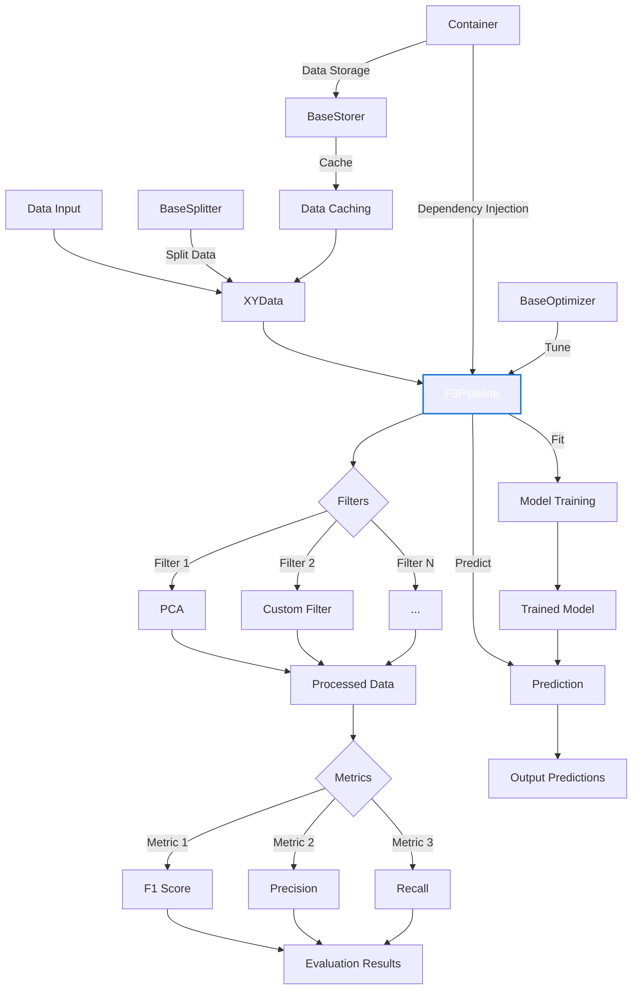

# 🏗️ Framework3 Architecture

Framework3 is designed with a modular, decoupled, and extensible architecture, built to support experimentation, evaluation, and comparison of models or processes in AI environments in a fully reproducible way.

### 🔌 Core Components

| Component       | Description                                               |
|----------------|-----------------------------------------------------------|
| [`BaseFilter`](../api/base/base_filter.md)   | Functional component that transforms, trains, or predicts |
| [`BasePipeline`](../api/base/base_pipelines.md) | Chains multiple filters into a sequential or parallel strategy |
| [`BaseMetric`](../api/base/base_metric.md)   | Evaluates the performance of models or pipelines          |
| [`BaseSplitter`](../api/base/base_splitter.md) | Splits data into folds for validation                     |
| [`BaseOptimizer`](../api/base/base_optimizer.md)| Optimizes hyperparameters over pipelines or filters       |
| [`BaseStorer`](../api/base/base_storage.md)   | Manages storage and retrieval of objects                  |

### 🔄 Typical Flow

<div style="zoom: 1.8; display: inline-block;">


</div>

### 🧬 Design Principles

- **Modularity**: Each class has a single responsibility and does it well.
- **Dependency Injection**: Plugins are registered and configured via a [`Container`](../api/container/container.md).
- **Extensibility**: Easily create new components without modifying the core.
- **Reproducibility**: All pipelines are configurable and fully traceable.

### 📦 Container and Dependency Injection

The [`Container`](../api/container/container.md) is a central component in Framework3, managing the registration and retrieval of various components. It allows for easy plugin management and dependency injection throughout the framework.

### 🔢 Data Handling

Framework3 uses the [`XYData`](../api/base/base_types.md) class for handling input and output data. This class provides a consistent interface for data manipulation across different components of the framework.

### 🔌 Plugin System

Framework3's plugin system allows for easy extension of the framework's capabilities. You can create custom filters, metrics, optimizers, and more by inheriting from the base classes and registering them with the Container.

### 📊 Example Workflow

Here's a basic example of how these components might interact in a typical workflow:

```python
from framework3 import (
    F1,
    F3Pipeline,
    KnnFilter,
    Precission,
    Recall,
    StandardScalerPlugin,
    WandbOptimizer,
    XYData,
    KFoldSplitter
)

from sklearn import datasets

# Prepare data
X = XYData(
    _hash="Iris X data",
    _path="/datasets",
    _value=iris.data,  # type: ignore
)
y = XYData(
    _hash="Iris y data",
    _path="/datasets",
    _value=iris.target,  # type: ignore
)

# Create pipeline
pipeline = F3Pipeline(
    filters=[
        StandardScalerPlugin(),
        KnnFilter().grid({
             'n_neighbors': [3, 5]
        })
    ],
    metrics=[F1(), Precission(), Recall()]
).splitter(
    KFoldSplitter(
        n_splits=2,
        shuffle=True,
        random_state=42,
    )
).optimizer(
    WandbOptimizer(
        project="test_project",
        sweep_id=None,
        scorer=F1(),
    )
)

# Fit and evaluate
pipeline.fit(x_data, y_data)
y_pred = XYData.mock(prediction.value)

results = pipeline.evaluate(x_data, y_data, y_pred)
```

For more detailed examples and use cases, check out the [Examples](../examples/index.md) section.

To explore all available components, methods, and configuration options, refer to the [API Reference](../api/index.md).
