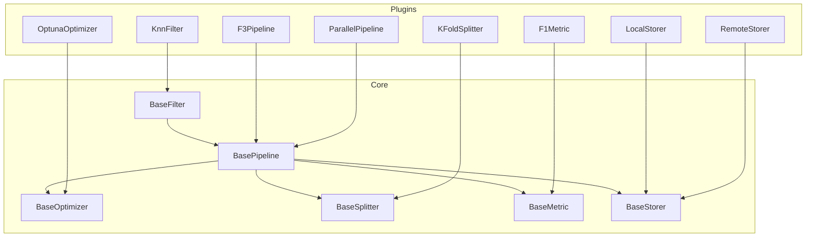

# Welcome to LabChain

## A Modular and Extensible LabChain for ML Experimentation

**LabChain** is a lightweight, flexible foundation for building machine learning experimentation systems that are **structured**, **extensible**, and **reusable**. Unlike rigid monolithic platforms, LabChain lets you craft your own workflows by composing modular components or reusing existing ones.

Its architecture is grounded in principles of **modularity**, **composability**, and **transparency**, enabling you to tailor each part of your workflow to fit your project's needs.

!!! warning
    Framework3 is under active development. While we strive for stability, caution is advised when using it in production environments.

## What *is* LabChain?

LabChain is **not a closed pipeline**, nor a library of pre-trained models. It’s a collection of **base interfaces** and **pluggable components** that empower you to:

- Design and combine filters, metrics, optimizers, and storers.
- Build reusable pipelines — sequential or parallel.
- Execute optimization or evaluation processes, even in distributed settings.
- Structure your experiments with clarity and complete control.

> Think of LabChain as a toolbox of interoperable building blocks — not a black-box solution.

## Key Features

- 🧩 **Modular architecture**: easily combine and reuse components.
- 🔌 **Extensible plugin system**: add new filters, metrics, or storers without modifying the core.
- 🧪 **Composable pipelines**: design sequential, parallel, or hybrid flows.
- 🧠 **Built-in optimization and evaluation**: test different configurations and track performance.
- 🧵 **Distributed processing**: supports parallel execution and MapReduce-style pipelines.

## Design Philosophy

1. **Composition over configuration**: each piece is designed to work seamlessly with others.
2. **Frictionless extensibility**: implement your own components by subclassing base interfaces.
3. **Full transparency**: inspect every step, metric, and decision in the workflow.

## Conceptual Diagram

## Repository Structure

LabChain is structured to be easy to navigate, extend, and maintain:

- `base/`: Fundamental interfaces and abstractions.
- `plugins/`: Filters, pipelines, metrics, optimizers, storers, and more.
- `container/`: Dependency injection system.
- `examples/`: Real-world use cases and tutorials.
- `tests/`: Unit and integration tests.
- `docs/`: Full documentation, including this page.

---

## 🚀 Ready to Get Started?

- 📚 **Quickstart Guide**: [quick_start/index.md](quick_start/index.md)
- 🧬 **Full API Reference**: [api/index.md](api/index.md)
- 🔍 **Examples and Recipes**: [examples/](examples/index.md)

## 🤝 Contribute

Interested in contributing? Check out the [Contribution Guidelines](https://github.com/manucouto1/LabChain/blob/main/docs/CONTRIBUTING.md).

## 📄 License

LabChain is licensed under **AGPL-3.0** — [View License](https://github.com/manucouto1/LabChain/blob/main/LICENSE)
